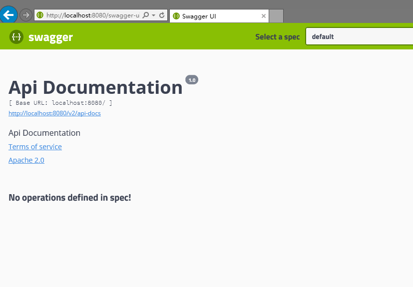

# 一、简介

快速构建REST APIs文档，免去了手动写API的繁琐，国内的工具有[RAP](https://github.com/thx/RAP)，阿里出品的。

## [swagger官方文档](https://swagger.io/docs/)

先在要把它整合到spring当中，使用springfox-swagger2工具，它是从swagger-springmvc上发展出来的。

<!--more-->

# 二、配置

1.引入jar包

```xml
<dependency>
    <groupId>io.springfox</groupId>
    <artifactId>springfox-swagger2</artifactId>
    <version>2.9.2</version>
</dependency>
<dependency>
    <groupId>io.springfox</groupId>
    <artifactId>springfox-swagger-ui</artifactId>
    <version>2.9.2</version>
</dependency>
<dependency>
    <groupId>org.springframework</groupId>
    <artifactId>spring-webmvc</artifactId>
    <version>5.0.8.RELEASE</version>
</dependency>
<dependency>
    <groupId>javax.servlet</groupId>
    <artifactId>javax.servlet-api</artifactId>
    <version>4.0.1</version>
    <scope>provided</scope>
</dependency>
<dependency>
    <groupId>org.slf4j</groupId>
    <artifactId>slf4j-nop</artifactId>
    <version>1.7.25</version>
</dependency>
<dependency>
    <groupId>com.fasterxml.jackson.core</groupId>
    <artifactId>jackson-databind</artifactId>
    <version>2.9.6</version>
</dependency>
```

2.新建Swagger的配置类，添加注解，让扫描进springmvc容器，不是spring的容器

```java
@Configuration
@EnableSwagger2
public class Swagger2Config {}
```

3.完成了，不需要其他配置，启动Tomcat服务器测试一下，在地址后面加上swagger-ui.html访问



# 添加Api

---